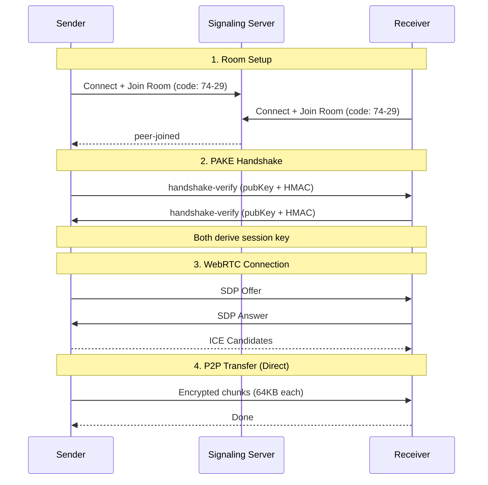

# Warp-LAN

Secure P2P file transfer with end-to-end encryption. Like AirDrop, but for any device.

## Features

- **End-to-End Encryption**: AES-256-GCM encryption, keys never leave your device
- **MITM Protection**: PAKE (Password Authenticated Key Exchange) prevents interception
- **Large File Support**: Streaming transfer handles 10GB+ files without loading into RAM
- **Zero Knowledge Server**: Signaling server only routes messages, never sees file content
- **No Account Required**: Just share a 4-digit code

## Architecture



## Tech Stack

- **Frontend**: React + TypeScript + Vite + Tailwind CSS + Framer Motion
- **Backend**: Go + Gorilla WebSocket
- **Crypto**: Web Crypto API (ECDH, AES-GCM, PBKDF2, HKDF)
- **Streaming**: StreamSaver.js for direct-to-disk writes

## Quick Start

### Prerequisites

- Node.js 18+
- Go 1.21+

### Run Locally

1. **Start the signaling server:**
```bash
cd server
go mod download
go run .
```

2. **Start the frontend:**
```bash
cd frontend
npm install
npm run dev
```

3. Open `http://localhost:3000`

## Deployment

### Backend (Railway)

1. Create new project on [Railway](https://railway.app)
2. Connect your GitHub repo
3. Set root directory to `/server`
4. Add environment variable:
   ```
   ALLOWED_ORIGINS=https://your-frontend-domain.vercel.app
   ```
5. Deploy

### Frontend (Vercel)

1. Import project on [Vercel](https://vercel.com)
2. Set root directory to `/frontend`
3. Add environment variable:
   ```
   VITE_SIGNALING_URL=wss://your-signaling-server.railway.app/ws
   ```
4. Deploy

## Security

See [SECURITY_AUDIT.md](./SECURITY_AUDIT.md) for full security analysis.

### How MITM is Prevented

1. Both peers derive a secret key from the shared room code using PBKDF2
2. Each peer generates an ephemeral ECDH keypair
3. Public keys are signed with HMAC using the code-derived key
4. Peers verify each other's signatures before deriving the session key
5. An attacker cannot forge signatures without knowing the room code

### Encryption Details

| Component | Algorithm |
|-----------|-----------|
| Key Derivation | PBKDF2 (100,000 iterations, SHA-256) |
| Key Exchange | ECDH (P-256) |
| Session Key | HKDF (SHA-256) |
| Data Encryption | AES-256-GCM |
| Authentication | HMAC-SHA256 |

## Project Structure

```
p2p_transfer/
├── server/                 # Go signaling server
│   ├── main.go            # HTTP server + rate limiting
│   ├── hub.go             # WebSocket hub + room management
│   ├── Dockerfile         # Production container
│   └── go.mod
├── frontend/              # React frontend
│   ├── src/
│   │   ├── lib/
│   │   │   ├── Security.ts        # PAKE implementation
│   │   │   ├── SignalingClient.ts # WebSocket client
│   │   │   ├── TransferEngine.ts  # WebRTC + file transfer
│   │   │   └── store.ts           # Zustand state
│   │   ├── components/
│   │   │   ├── DropZone.tsx      # File selection
│   │   │   ├── CodeDisplay.tsx   # Show transfer code
│   │   │   ├── CodeInput.tsx     # Enter transfer code
│   │   │   ├── TransferView.tsx  # Progress + speed graph
│   │   │   └── Header.tsx
│   │   └── App.tsx
│   └── package.json
├── SECURITY_AUDIT.md
└── README.md
```

## Configuration

### Environment Variables

**Server:**
| Variable | Description | Default |
|----------|-------------|---------|
| `PORT` | HTTP server port | `8080` |
| `ALLOWED_ORIGINS` | Comma-separated allowed CORS origins | `*` (dev only) |

**Frontend:**
| Variable | Description | Default |
|----------|-------------|---------|
| `VITE_SIGNALING_URL` | WebSocket signaling server URL | `ws://localhost:8080/ws` |

## License

MIT
