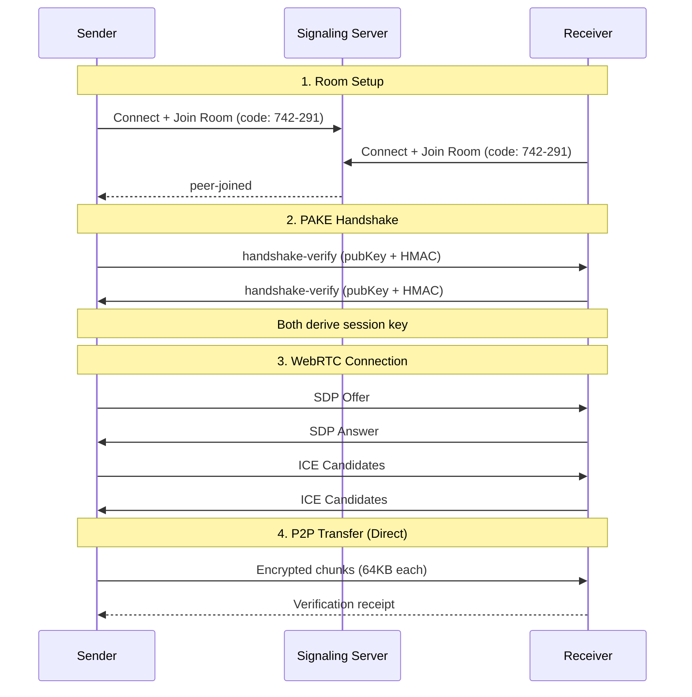

# Warp — Peer-to-Peer File Transfer

Send files directly between devices. End-to-end encrypted, no cloud storage, no account needed — just a 6-digit code.

## How It Works

1. Sender drops a file and gets a 6-digit code
2. Receiver enters the code on their device
3. Devices connect directly via WebRTC
4. File transfers peer-to-peer with SHA-256 verification

The signaling server only brokers the initial connection. Once peers find each other, all data flows directly between them.

## Features

- End-to-end encryption (AES-256-GCM, keys never leave the device)
- Files up to 25 GB — streamed in chunks, never loaded into memory
- Works on any device with a browser, no install required
- Direct-to-disk downloads via service worker
- Real-time progress with speed and ETA

## Architecture


```mermaid
sequenceDiagram
    participant Sender
    participant Server as Signaling Server
    participant Receiver

    Note over Sender,Receiver: 1. Room Setup
    Sender->>Server: Connect + Join Room (code: 742-291)
    Receiver->>Server: Connect + Join Room (code: 742-291)
    Server-->>Sender: peer-joined

    Note over Sender,Receiver: 2. PAKE Handshake
    Sender->>Receiver: handshake-verify (pubKey + HMAC)
    Receiver->>Sender: handshake-verify (pubKey + HMAC)
    Note over Sender,Receiver: Both derive session key

    Note over Sender,Receiver: 3. WebRTC Connection
    Sender->>Receiver: SDP Offer
    Receiver->>Sender: SDP Answer
    Sender->>Receiver: ICE Candidates
    Receiver->>Sender: ICE Candidates

    Note over Sender,Receiver: 4. P2P Transfer (Direct)
    Sender->>Receiver: Encrypted chunks (64KB each)
    Receiver-->>Sender: Verification receipt
```

## Security

The signaling server is treated as untrusted — even if compromised, it can't read files or impersonate peers. Both devices derive a shared secret from the room code and use a PAKE handshake to authenticate each other before exchanging keys. All encryption runs in the browser via the Web Crypto API.

Room codes expire after 10 minutes, rooms are limited to 2 peers, and connections are rate-limited per IP.

## Built With

React · TypeScript · Tailwind CSS · Zustand · Vite — frontend
Go · Gorilla WebSocket — signaling server

## Self-Hosting

```bash
docker build -t warp .
docker run -p 8080:8080 -e ALLOWED_ORIGINS=https://your-frontend.com warp
```

## Development

```bash
# Signaling server
cd server && go run .

# Frontend
cd frontend && npm install && npm run dev
```

Open `localhost:3000` in two tabs to test a transfer.

## License

MIT
