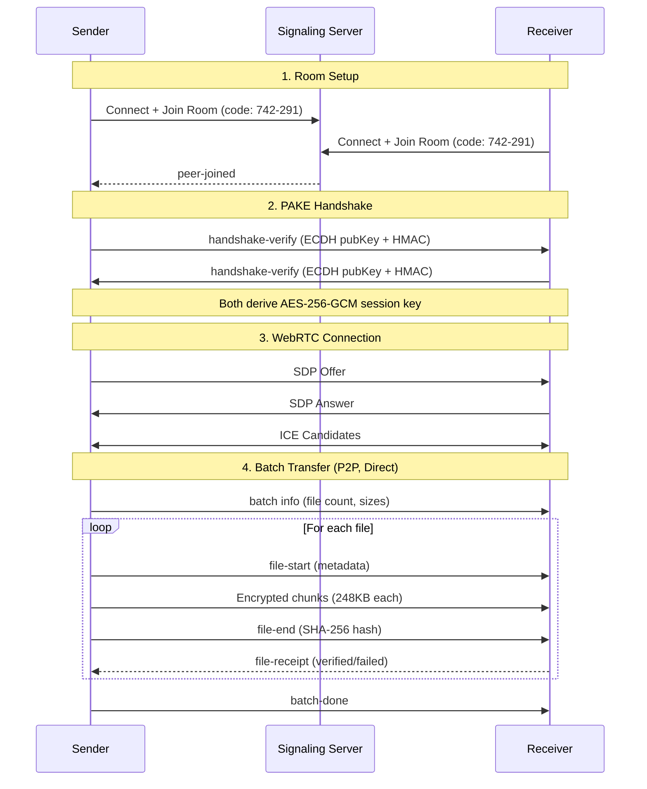

# Warp — Peer-to-Peer Encrypted File Transfer

Send files directly between devices. End-to-end encrypted, no cloud storage, no account needed — just a 6-digit code.

**No file size limit.** Files stream in 248KB encrypted chunks with constant ~1MB memory usage regardless of size.

## How It Works

1. Sender drops files and gets a 6-digit code
2. Receiver enters the code on their device
3. Devices connect directly via WebRTC
4. Files transfer peer-to-peer with per-file SHA-256 verification

The signaling server only brokers the initial connection. Once peers find each other, all data flows directly between them — the server never sees your files.

## Features

- **End-to-end encryption** — AES-256-GCM with PAKE handshake (keys never leave the device)
- **No file size limit** — streaming architecture, constant memory
- **Multi-file batch transfer** — send multiple files sequentially with per-file verification
- **Pause/resume** — pause mid-transfer, resume without losing progress
- **Installable PWA** — works offline (app shell), installable on mobile/desktop
- **3D visualization** — animated warp tunnel reacts to transfer state
- **Real-time progress** — speed, ETA, dual progress bars (per-file + batch)
- **Zero-knowledge** — server cannot read files, derive keys, or impersonate peers
- **Works everywhere** — any device with a modern browser, no install required

## Architecture


```mermaid
sequenceDiagram
    participant Sender
    participant Server as Signaling Server
    participant Receiver

    Note over Sender,Receiver: 1. Room Setup
    Sender->>Server: Connect + Join Room (code: 742-291)
    Receiver->>Server: Connect + Join Room (code: 742-291)
    Server-->>Sender: peer-joined

    Note over Sender,Receiver: 2. PAKE Handshake
    Sender->>Receiver: handshake-verify (ECDH pubKey + HMAC)
    Receiver->>Sender: handshake-verify (ECDH pubKey + HMAC)
    Note over Sender,Receiver: Both derive AES-256-GCM session key

    Note over Sender,Receiver: 3. WebRTC Connection
    Sender->>Receiver: SDP Offer
    Receiver->>Sender: SDP Answer
    Sender<<->>Receiver: ICE Candidates

    Note over Sender,Receiver: 4. Batch Transfer (P2P, Direct)
    Sender->>Receiver: batch info (file count, sizes)
    loop For each file
        Sender->>Receiver: file-start (metadata)
        Sender->>Receiver: Encrypted chunks (248KB each)
        Sender->>Receiver: file-end (SHA-256 hash)
        Receiver-->>Sender: file-receipt (verified/failed)
    end
    Sender->>Receiver: batch-done
```

## Security

| Layer                  | Protection                                                                                |
| ---------------------- | ----------------------------------------------------------------------------------------- |
| **PAKE handshake**     | PBKDF2 (100k iterations) + ECDH P-256 + HMAC-SHA256 — both peers prove they know the code |
| **Session encryption** | AES-256-GCM with random 12-byte IV per chunk via HKDF-derived session key                 |
| **Integrity**          | SHA-256 streaming hash per file, verified on completion                                   |
| **Transport**          | WebRTC DTLS (mandatory) + our app-layer AES-GCM (defense in depth)                        |
| **Server isolation**   | Signaling server relays JSON only — cannot read files, derive keys, or spoof peers        |
| **Room security**      | 6-digit codes expire in 10 minutes, rooms limited to 2 peers, IP rate-limited             |

## Tech Stack

**Frontend:** React 18 · TypeScript · Tailwind CSS · Zustand · Framer Motion · Three.js (R3F) · Vite · Playwright

**Backend:** Go · Gorilla WebSocket · Channel-based event loop

## Performance

| Metric           | Value                                            |
| ---------------- | ------------------------------------------------ |
| Chunk size       | 248 KB (optimized for WebRTC SCTP)               |
| Buffer threshold | 64 MB (backpressure)                             |
| Memory usage     | ~1 MB constant (regardless of file size)         |
| LAN speed        | 30-70 MB/s (direct P2P)                          |
| Hash computation | Streaming (computed during transfer, not before) |

## Deployment

### Backend → Render (Free)

1. **New > Blueprint** at [render.com](https://render.com) → connect your GitHub repo
2. Render reads `render.yaml` automatically
3. Your WebSocket endpoint: `wss://warp-lan-signaling.onrender.com/ws`

### Frontend → Vercel (Free)

1. **Import Project** at [vercel.com](https://vercel.com) → connect your GitHub repo
2. Set **Root Directory** to `frontend`
3. Add environment variable: `VITE_SIGNALING_URL = wss://warp-lan-signaling.onrender.com/ws`
4. Deploy

See [DEPLOY.md](DEPLOY.md) for detailed instructions including Back4app and self-hosting options.

## Self-Hosting

```bash
# Docker
docker build -t warp .
docker run -p 8080:8080 -e ALLOWED_ORIGINS=https://your-frontend.com warp

# Or run directly
cd server && go run .
```

## Development

```bash
# Backend (signaling server)
cd server && go run .

# Frontend (dev server)
cd frontend && npm install && npm run dev

# Run tests
cd frontend && npm run test:run    # Unit tests (122 tests)
cd frontend && npm run test:e2e    # E2E tests (Playwright)
cd frontend && npm run lint        # ESLint
```

Open `localhost:3000` in two tabs to test a transfer.

## License

MIT
