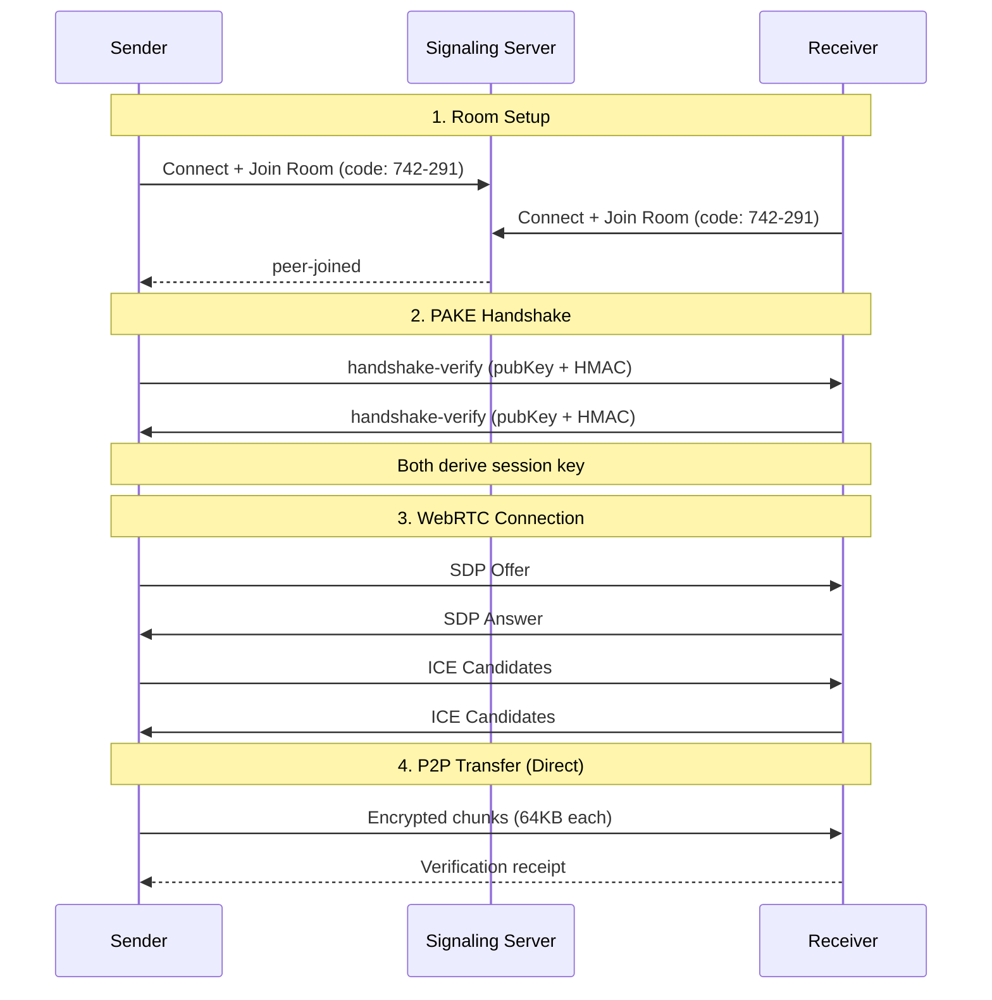

# Warp-LAN — Secure Peer-to-Peer File Transfer

Send files directly between any two devices with end-to-end encryption. No cloud, no signup, no size limits — just a 6-digit code. Like AirDrop, but works across any device with a browser.

**Zero Install** · **No Account** · **End-to-End Encrypted** · **Cross-Platform** · **Up to 25 GB**

---

## How It Works

1. **Sender** drops a file and gets a 6-digit code
2. **Receiver** enters the code on their device
3. Devices connect directly — the file never touches a server
4. Transfer completes with automatic SHA-256 integrity verification

The signaling server only helps the two devices find each other. Once connected, all data flows peer-to-peer through an encrypted WebRTC DataChannel.

---

## Features

- **End-to-End Encryption** — AES-256-GCM; encryption keys are derived on-device and never transmitted
- **MITM Protection** — PAKE (Password Authenticated Key Exchange) ensures both peers prove they know the room code before exchanging keys
- **Large File Support** — Streaming architecture handles files up to 25 GB without loading them into memory. Uses 64 KB chunks with backpressure control
- **SHA-256 Integrity Verification** — Every file is hashed incrementally before sending; the receiver verifies the hash after download and sends a receipt
- **Zero Knowledge Server** — The signaling server only routes WebSocket messages to connect peers. It never sees file content, encryption keys, or metadata
- **No Account Required** — Share a 6-digit code. No signup, no login, no cookies
- **Direct-to-Disk Downloads** — StreamSaver.js writes received data directly to disk, avoiding browser memory limits
- **Real-Time Progress** — Live ETA, speed, and percentage with 200ms sampling

---

## Architecture Overview

Warp-LAN has two components: a lightweight **Go signaling server** and a **React SPA** frontend. The signaling server brokers the initial connection over WebSocket, then steps aside. The frontend handles all cryptography, WebRTC negotiation, and file I/O entirely in the browser.

After signaling completes, all file data travels peer-to-peer via WebRTC DataChannel — the server is not in the data path.


```mermaid
sequenceDiagram
    participant Sender
    participant Server as Signaling Server
    participant Receiver

    Note over Sender,Receiver: 1. Room Setup
    Sender->>Server: Connect + Join Room (code: 742-291)
    Receiver->>Server: Connect + Join Room (code: 742-291)
    Server-->>Sender: peer-joined

    Note over Sender,Receiver: 2. PAKE Handshake
    Sender->>Receiver: handshake-verify (pubKey + HMAC)
    Receiver->>Sender: handshake-verify (pubKey + HMAC)
    Note over Sender,Receiver: Both derive session key

    Note over Sender,Receiver: 3. WebRTC Connection
    Sender->>Receiver: SDP Offer
    Receiver->>Sender: SDP Answer
    Sender->>Receiver: ICE Candidates
    Receiver->>Sender: ICE Candidates

    Note over Sender,Receiver: 4. P2P Transfer (Direct)
    Sender->>Receiver: Encrypted chunks (64KB each)
    Receiver-->>Sender: Verification receipt
```

### Connection Phases

1. **Room Setup** — Both peers connect to the signaling server via WebSocket and join the same room using the 6-digit code
2. **PAKE Handshake** — Each peer derives a secret from the room code (PBKDF2), generates an ECDH keypair, and signs their public key with HMAC. Both verify the other's signature — this prevents MITM attacks
3. **WebRTC Connection** — Sender creates an SDP offer, receiver sends an answer, ICE candidates are exchanged to find the best network path
4. **Encrypted P2P Transfer** — File is split into 64 KB chunks, each encrypted with AES-256-GCM using the derived session key, sent over the DataChannel. Receiver decrypts, writes to disk, and incrementally hashes
5. **Verification & Receipt** — Receiver computes final SHA-256 hash, compares with sender's hash, and sends a verified/failed receipt back

---

## Tech Stack

### Frontend

| Technology | Role |
|---|---|
| React 18 | UI framework |
| TypeScript (strict) | Type safety across the entire frontend |
| Vite 7 | Dev server + production bundler |
| Tailwind CSS | Utility-first styling (minimal dark theme) |
| Framer Motion | Animations and transitions |
| Zustand | Lightweight client state management |
| StreamSaver.js | Direct-to-disk file writing (bypasses browser memory) |
| Web Crypto API | All cryptographic operations (ECDH, AES-GCM, PBKDF2, HKDF, HMAC) |
| js-sha256 | SHA-256 streaming hash for file integrity |

### Backend

| Technology | Role |
|---|---|
| Go 1.25 | Signaling server runtime |
| Gorilla WebSocket | WebSocket connection handling |
| google/uuid | Client ID generation |

### Infrastructure

| Technology | Role |
|---|---|
| Back4app Containers | Backend hosting (Docker, health checks, always-on) |
| Vercel | Frontend hosting (SPA routing, security headers) |
| GitHub Actions | CI pipeline (lint, test, build) |
| Docker (multi-stage) | Production server image (~10 MB, scratch base) |

---

## Security

The threat model assumes the signaling server is untrusted — even if compromised, it cannot read files or forge handshakes. The room code is the shared secret; its brevity (6 digits = 1M combinations) is mitigated by rate limiting (20 connections/min/IP), room expiry (10 min), and a max 2-peer room capacity. All cryptography runs in the browser via the Web Crypto API — no custom implementations.

### How MITM Is Prevented

1. Both peers derive a secret key from the shared room code using PBKDF2
2. Each peer generates an ephemeral ECDH keypair
3. Public keys are signed with HMAC using the code-derived key
4. Peers verify each other's signatures before deriving the session key
5. An attacker cannot forge signatures without knowing the room code

### Encryption Details

| Component | Algorithm |
|---|---|
| Key Derivation | PBKDF2 (100,000 iterations, SHA-256) |
| Key Exchange | ECDH (P-256) |
| Session Key | HKDF (SHA-256) |
| Data Encryption | AES-256-GCM |
| Authentication | HMAC-SHA256 |

---

## Project Structure

```
p2p_transfer/
├── server/                          # Go signaling server
│   ├── main.go                      # HTTP server, CORS, rate limiting, security headers
│   ├── hub.go                       # WebSocket hub, room management, message routing
│   ├── hub_test.go                  # Hub unit tests
│   ├── main_test.go                 # Server integration tests
│   ├── go.mod
│   └── go.sum
├── frontend/                        # React SPA
│   ├── public/
│   │   ├── favicon.svg
│   │   └── mitm.html               # StreamSaver service worker proxy
│   ├── src/
│   │   ├── main.tsx                 # React entry point
│   │   ├── App.tsx                  # Top-level routing (send/receive/transfer screens)
│   │   ├── index.css                # Global styles
│   │   ├── components/
│   │   │   ├── Header.tsx           # App header
│   │   │   ├── DropZone.tsx         # File drag-and-drop / picker
│   │   │   ├── CodeDisplay.tsx      # Shows transfer code + QR to sender
│   │   │   ├── CodeInput.tsx        # Code entry form for receiver
│   │   │   └── TransferView.tsx     # Progress bar, ETA, completion status
│   │   ├── lib/
│   │   │   ├── TransferEngine.ts    # Core: WebRTC connection + chunked file transfer
│   │   │   ├── SignalingClient.ts   # WebSocket client with reconnection
│   │   │   ├── Security.ts          # PAKE handshake + AES-256-GCM encrypt/decrypt
│   │   │   ├── StreamingHasher.ts   # Incremental SHA-256 hashing (constant memory)
│   │   │   ├── store.ts             # Zustand store (app state + actions)
│   │   │   ├── logger.ts            # Structured logger with level filtering
│   │   │   └── __tests__/           # Unit tests for lib modules
│   │   └── types/
│   │       ├── index.ts             # Shared types, error mappings, file utilities
│   │       └── __tests__/
│   ├── .env.example                 # Environment variable template
│   ├── index.html                   # HTML shell
│   ├── package.json
│   ├── tsconfig.json                # TypeScript strict config
│   ├── vite.config.ts               # Dev server (port 3000) + build config
│   ├── vitest.config.ts             # Test runner config (jsdom, v8 coverage)
│   ├── tailwind.config.js           # Minimal dark theme
│   ├── postcss.config.js
│   └── vercel.json                  # Vercel: SPA routing + security headers
├── .github/workflows/
│   └── ci.yml                       # CI: test frontend (Node 20) + backend (Go 1.25)
├── Dockerfile                       # Multi-stage Go build → scratch image
├── .gitignore
└── README.md
```

---

## Getting Started

### Prerequisites

- Node.js 20+ and npm
- Go 1.25+ (or Docker for containerized build)

### Run Locally

```bash
# 1. Start the signaling server (terminal 1)
cd server
go mod download
go run .
# Server runs on http://localhost:8080

# 2. Start the frontend (terminal 2)
cd frontend
npm install
npm run dev
# Frontend runs on http://localhost:3000

# 3. Open http://localhost:3000 in two browser tabs to test a transfer
```

### Run Tests

```bash
# Frontend tests
cd frontend
npm run test:run

# Backend tests
cd server
go test -v -race ./...
```

---

## Configuration

### Server Environment Variables

| Variable | Description | Default |
|---|---|---|
| `PORT` | HTTP server port | `8080` |
| `ALLOWED_ORIGINS` | Comma-separated CORS origins | `*` (dev only) |
| `TURN_URL` | TURN server URL (e.g. `turn:coturn.example.com:3478`) | — (STUN-only fallback) |
| `TURN_SECRET` | TURN shared secret for HMAC-SHA1 credential generation | — |

### Frontend Environment Variables (`frontend/.env`)

| Variable | Required | Description | Default |
|---|---|---|---|
| `VITE_SIGNALING_URL` | Yes | WebSocket URL for the signaling server | `ws://localhost:8080/ws` |
| `VITE_ICE_TRANSPORT_POLICY` | No | `'all'` or `'relay'` — force TURN relay for testing | `all` |
| `VITE_LOG_LEVEL` | No | Log level: `debug`, `info`, `warn`, `error` | `info` |

See `frontend/.env.example` for the full template.

---

## Deployment

### Backend → Back4app Containers

1. Sign up at [back4app.com](https://back4app.com) (free, no credit card required)
2. Go to **Containers** section and connect your GitHub repo
3. Set Dockerfile path to `./Dockerfile`, health check to `/health`
4. Set environment variable: `ALLOWED_ORIGINS=https://your-frontend.vercel.app`
5. Deploy — Back4app builds the Docker image and runs health checks on `/health`

### Frontend → Vercel

1. Import the repo on [Vercel](https://vercel.com)
2. Set root directory to `frontend`
3. Set environment variable: `VITE_SIGNALING_URL=wss://your-app.b4a.run/ws`
4. Deploy — Vercel uses `vercel.json` for SPA routing and security headers

### Docker (Self-Hosted)

```bash
docker build -t warp-lan .
docker run -p 8080:8080 -e ALLOWED_ORIGINS=https://your-frontend.com warp-lan
```

The production image is ~10 MB (scratch base, statically compiled Go binary).

---

## Testing & CI

### Frontend (Vitest + jsdom)

- 117 tests across 5 test suites
- Covers: TransferEngine (ICE queuing, timeout, backpressure, metadata validation), PAKE handshake, signaling client, Zustand store, type utilities
- `npm run test:run` — single run; `npm run test:coverage` — with v8 coverage

### Backend (Go test)

- 28 tests with race detection
- Covers: hub lifecycle, room management, WebSocket integration, rate limiting, CORS, health endpoint
- `go test -v -race ./...`

### CI (GitHub Actions — `.github/workflows/ci.yml`)

- Triggered on push/PR to `main`
- **Frontend job:** Node 20 → `npm ci` → lint → test → build
- **Backend job:** Go 1.25 → `go mod download` → test with race detection → build
- Artifacts: frontend dist + backend coverage report (7-day retention)

---

## License

MIT
